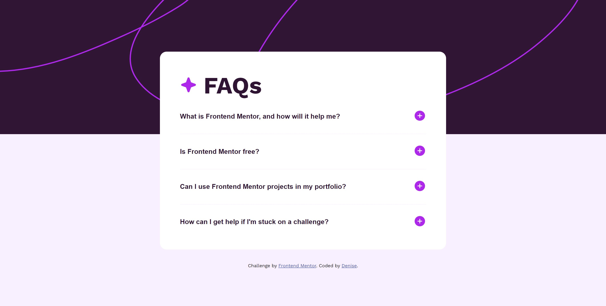

# Frontend Mentor - FAQ accordion solution

This is a solution to the [FAQ accordion challenge on Frontend Mentor](https://www.frontendmentor.io/challenges/faq-accordion-wyfFdeBwBz). Frontend Mentor challenges help you improve your coding skills by building realistic projects.

## Table of contents

- [Overview](#overview)
  - [The challenge](#the-challenge)
  - [Screenshot](#screenshot)
  - [Links](#links)
- [My process](#my-process)
  - [Built with](#built-with)
  - [What I learned](#what-i-learned)
  - [Continued development](#continued-development)
  - [Useful resources](#useful-resources)
- [Author](#author)

## Overview

### The challenge

Users should be able to:

- Hide/Show the answer to a question when the question is clicked
- Navigate the questions and hide/show answers using keyboard navigation alone
- View the optimal layout for the interface depending on their device's screen size
- See hover and focus states for all interactive elements on the page

### Screenshot

### Links

- [Solution URL](https://www.frontendmentor.io/solutions/faq-accordion-9tCVLCFQeh)
- [Live Site URL](https://stellar-halva-644a70.netlify.app/)

## My process

### Built with

- Semantic HTML5 markup
- CSS custom properties
- Flexbox
- Mobile-first workflow

### What I learned

I learned that there's moments where you need to utilize your existing tools, and not attempt to re-invent the wheel.
Took me days attempting to build the accordion panels, I think my problem was trying to rush in. When what I should've done is broken it down more. I guess in restrospect after seeing how others have addressed it, I can now better understand the steps to take.

---

Re-worked: Welp, after re-working this project the styling became easier. The tricky part was making an accordion component without the use of Javascript. It's was good practice for me to use a little more intermediate level CSS. I considered using SCSS, but that felt like it be a little cheating. To be fare I did use an existing codepen to get some ideas as to how to approach the project, that's ok plus I learned something new.

### Continued development

I'd like to continue to learn how to build these common components, atleast to the point where it comes with ease.
I won't be too hard on myself becasue I know these things come with time!

---

Re-worked: I've come along way since the first time I tackled this project. I've learned so much since, developed better working patterns, as well as developed complex projects. It stiil resulted to  be quite difficult JS version of this was easy in comparisson. 
I'd like to continue learning accessibility as well as pseudo styling. Theres so much still left to learn. 
Wish me luck!

### Useful resources

- Accordion [How to Accordion ](https://www.w3schools.com/howto/howto_js_accordion.asp) - This helped me understand how to do the collapsible accordion panel.

- NO JS [No JS Accordion](https://codepen.io/raubaca/pen/PZzpVe?editors=1100) - helped me come up with a solution to the no JS

## Author

- Frontend Mentor - [@moncadad](https://www.frontendmentor.io/profile/moncadad)
